    ## Задание 1. Письменно ответьте на следующие вопросы (ответы формулируйте кратко и по существу):
### 1. Из каких основных компонентов состоит стандартный HTTP-запрос?
```
Стандартный HTTP-запрос состоит из стартовой строки (метод, целевой ресурс, версия протокола),
заголовков, пустой строки и тела сообщения.
```
### 2. В чем фундаментальное различие между статус-кодами класса 4xx и класса 5xx?
```
4xx (Client Error) - ошибка клиента. Сервер не смог понять или обработать запрос из-за проблемы на стороне клиента.
5xx (Server Error) - ошибка сервера. Сервер столкнулся с внутренней проблемой и не смог обработать запрос, хотя сам клиент сделал всё правильно.
```
### 3. Что содержит первая строка (стартовая строка) HTTP-ответа?
```
Первая строка HTTP-ответа содержит версию протокола, код состояния и поясняющую фразу.
```
### 4. Для чего предназначен заголовок Content-Type в HTTP-сообщении?
```
Заголовок Content-Type в HTTP-сообщении предназначен для того, чтобы указать тип носителя данных,
которые передаются в теле сообщения, помогая клиенту и серверу правильно понять и интерпретировать информацию.
```
## Задания 2. Изучите интерфейс и основные возможности встроенного в ваш браузер инструмента разработчика.
### 1. Просмотр кода содержимого веб-страницы (HTML, CSS и JS).
HTML - код

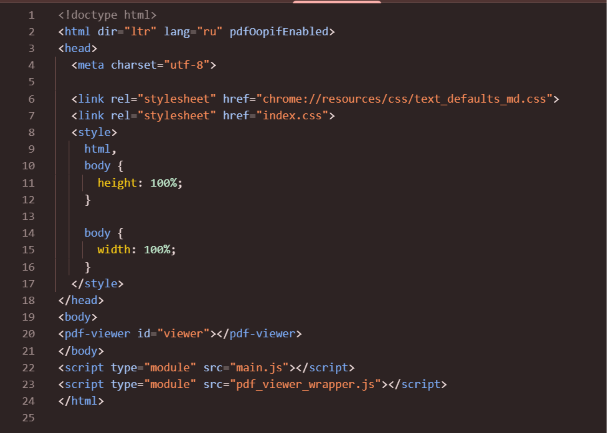

CSS - код

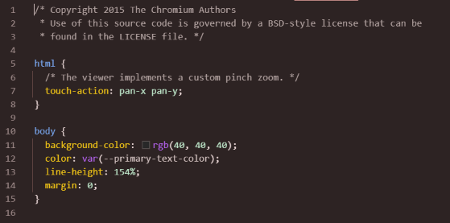

JS - Код

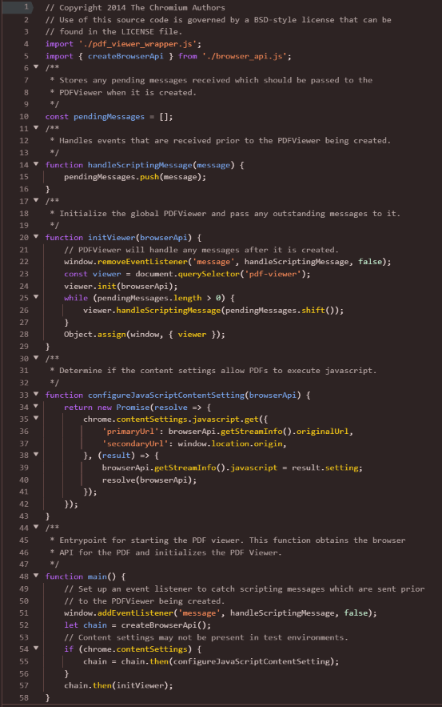
### 2. Поиск кода, который соответствует элементу на странице.
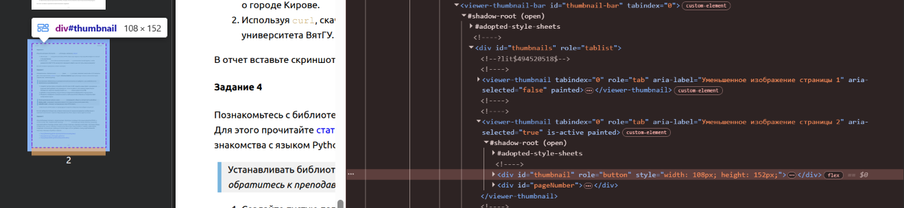
### 3. Отследите HTTP-трафик страницы во время и после ее загрузки
Трафик до загрузки страницы.

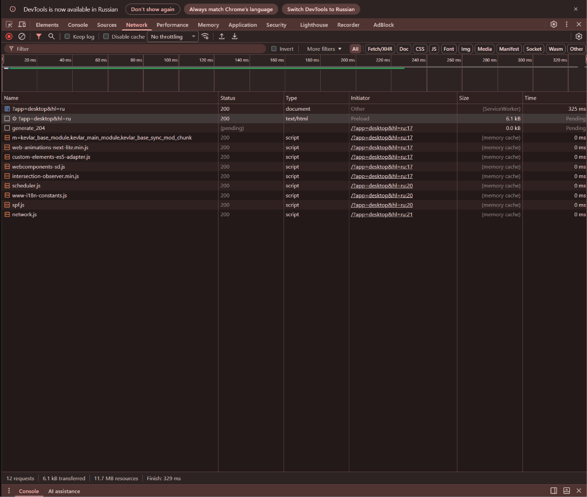

Трафик после загрузки страницы.

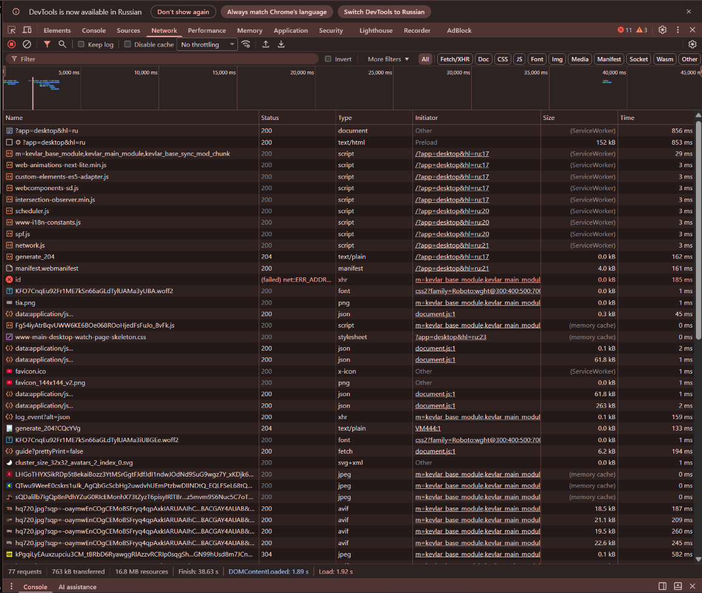
### 4. Просмотр обнаруженных ошибок в коде страницы.
Ошибки и предупреждения при загрузке страницы YouTube

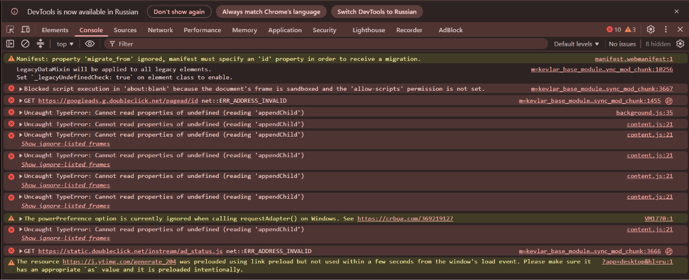
### 5. Просмотр времени загрузки страницы.
Время загрузки страницы YouTube.


### 6. Просмотр версии протокола HTTP, которая использовалась при получении веб-ресурсов.
Protocol поставлен в столбце Status.

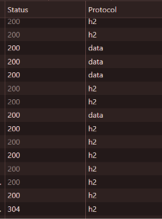
## Задание 3. Изучите материал об утилите curl, используя, например, ресурс.
### 1. Используя curl, получите заголовки HTTP-ответа при запросе страницы Википедии со статьей о городе Кирове.
curl -I -L "https://ru.wikipedia.org/wiki/Киров"

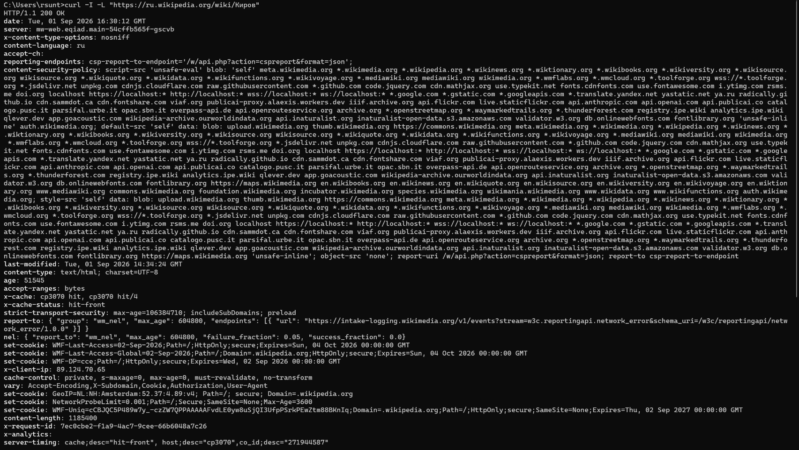
### 2. Используя curl, скачайте на компьютер файл pdf с расписанием вашей группы с сайта университета ВятГУ. По какому пути скачивается файл и как этот путь можно изменить?
Без указания пути файл скачивается туда, откуда была выполнена команда.

curl -O "https://www.vyatsu.ru/reports/schedule/Group/26248_1_01092026_13092026.pdf"

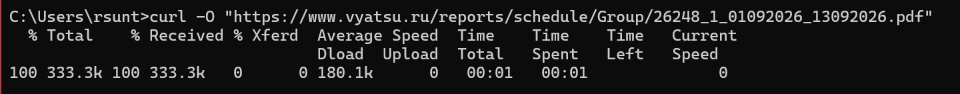

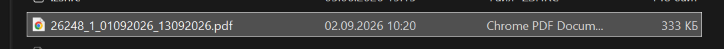

С указанием пути.

curl -o "C:\Users\rsunt\Downloads\schedule.pdf" "https://www.vyatsu.ru/reports/schedule/Group/26248_1_01092026_13092026.pdf"

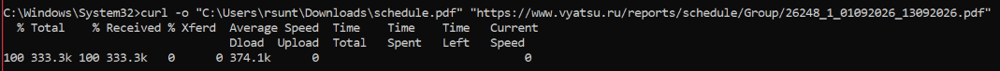

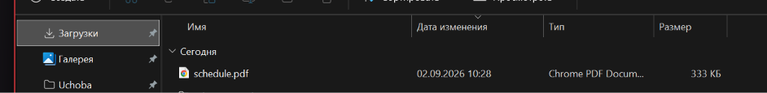

## Задания 4.Познакомьтесь с библиотекой requests (язык python), которая позволяет выполнять HTTP-запросы. Для этого прочитайте статью из курса «Основы Python» (данный ресурс можно использовать для знакомства с языком Python).

```
import requests

def get_map(lon, lat, zoom=15, map_type="map"):

    base_url = "https://static-maps.yandex.ru/1.x/"

    params = {
        "ll": f"{lon},{lat}",
        "z": zoom,
        "l": map_type,
        "size": "650,450",
        "lang": "ru_RU"
    }

    response = requests.get(base_url, params=params)

    if response.status_code == 200:
        print("Запрос выполнен успешно!")

        with open("map_image.png", "wb") as file:
            file.write(response.content)
        print("Изображение сохранено как 'map_image.png'")

    else:
        print(f"Ошибка! Код статуса: {response.status_code}")
        print(f"Содержимое ответа: {response.text}")

    return response

longitude = 49.6805740
latitude = 58.5913620

get_map(longitude, latitude, zoom=17, map_type="map")
```
Полученное по координатам изображение с карт с помощью кода изображение.

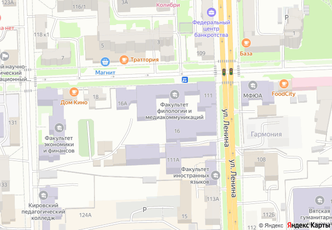

Полученное по координатам изображение с карт с помощью HTTP-запроса.

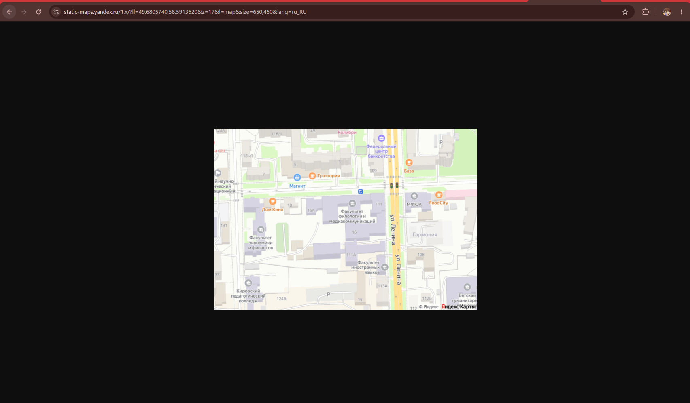

### Задание 5 Изучите базовый синтаксис, семантическую структуру и основные теги языка разметки HTML5, а также основы CSS. Создайте веб-страницу index.html посвещённую своему проекту, например, курсовой работе. Страница должна иметь четкую структуру, содержать заголовок, текстовые абзацы, изображения, списки, таблицу и гиперссылки. Используя навыки работы с GitHub, опубликуйте  созданную статическую страницу на GitHub Pages. В отчет добавьте ссылку опубликованной страницы.

https://scr1llz.github.io/SiteLab1/